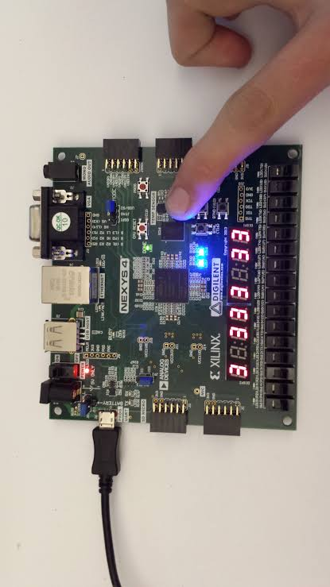
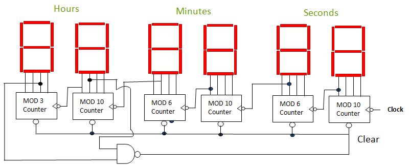
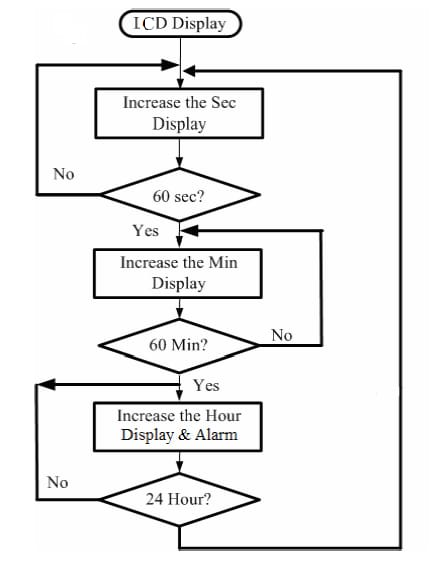
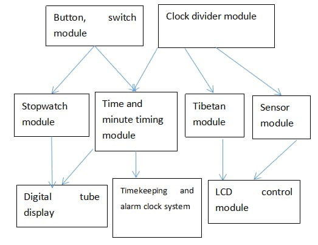
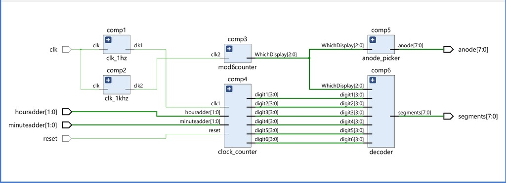
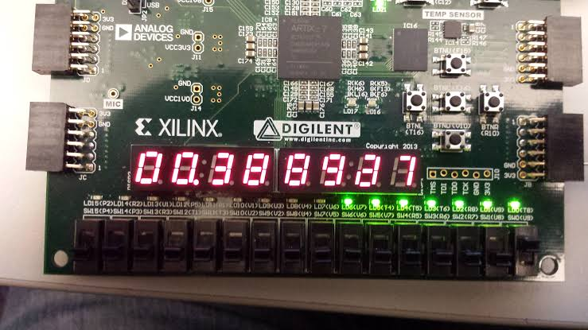
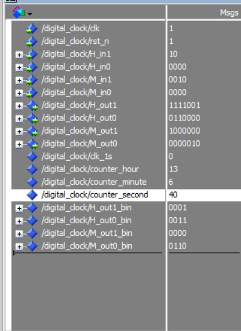
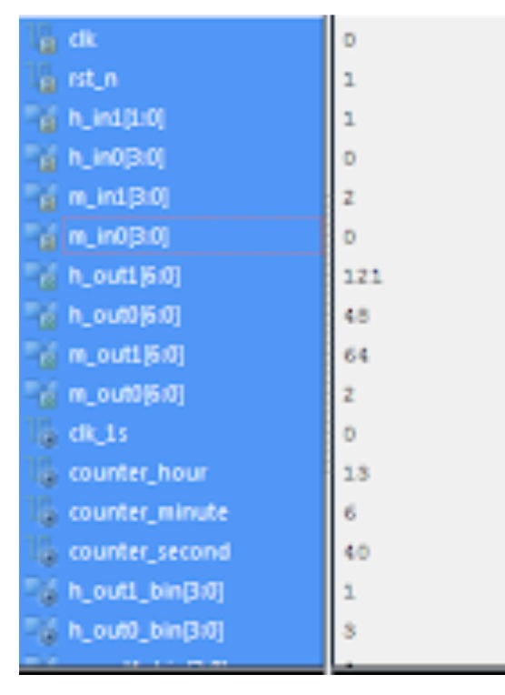

# ⏰ Digital Clock Design using VHDL on FPGA



---

## 📘 Overview  
This project showcases the design and implementation of a **Digital Clock** using **VHDL** on the **Nexys 4 Artix-7 FPGA Board**.  
The clock displays **hours, minutes, and seconds** on 7-segment LED displays and operates in real time using a 1 Hz signal derived from a 50 MHz onboard clock.

It was **simulated in ModelSim** and **synthesized in Vivado**, following a structured VLSI design flow: RTL Design → Simulation → Synthesis → FPGA Deployment.

---

## 🎯 Objectives
- Implement a **real-time digital clock** using modular VHDL design.  
- Convert a **50 MHz clock signal** into a **1 Hz pulse** using frequency division.  
- Display time on **7-segment displays (HH:MM:SS)**.  
- Verify design through **simulation and FPGA testing**.

---

## 🧠 Tech Stack

| Category | Tools / Components |
|-----------|--------------------|
| **Language** | VHDL |
| **Simulation Tool** | ModelSim |
| **Synthesis Tool** | Xilinx Vivado |
| **Hardware** | Nexys 4 Artix-7 FPGA Board |
| **Display Type** | 7-Segment LED |
| **Clock Frequency** | 50 MHz (converted to 1 Hz) |

---

## ⚙️ System Flow

### 🧩 Flowchart  
  
> The design increments seconds → minutes → hours cyclically, resetting after 60 seconds, 60 minutes, and 24 hours.

---

## 🧱 Architecture Design

### 🔹 Architecture using MOD Counters  
  
> The clock uses cascaded MOD-10, MOD-6, and MOD-3 counters to represent seconds, minutes, and hours respectively.

### 🔹 Functional Module Diagram  
  
> Modular components handle timekeeping, display control, button switches, and clock division.

### 🔹 Main Block Diagram  
  
> The top-level design integrates switch inputs, the time module, and 7-segment display outputs.

---

## 💻 Implementation

### 🧩 Frequency Divider (50 MHz → 1 Hz)
```vhdl
if rising_edge(clk_50) then
    counter <= counter + 1;
    if counter >= x"2FAF080" then
        counter <= x"0000000";
    end if;
end if;
clk_1s <= '0' when counter < x"17D7840" else '1';
````

### 🧩 Time Counter (HH:MM:SS)

```vhdl
if rising_edge(clk_1s) then
    counter_second <= counter_second + 1;
    if counter_second = 59 then
        counter_second <= 0;
        counter_minute <= counter_minute + 1;
        if counter_minute = 59 then
            counter_minute <= 0;
            counter_hour <= counter_hour + 1;
            if counter_hour = 24 then
                counter_hour <= 0;
            end if;
        end if;
    end if;
end if;
```

### 🧩 7-Segment Decoder

```vhdl
case Bin is
    when "0000" => Hout <= "1000000"; -- 0
    when "0001" => Hout <= "1111001"; -- 1
    when "0010" => Hout <= "0100100"; -- 2
    when "0011" => Hout <= "0110000"; -- 3
    when "0100" => Hout <= "0011001"; -- 4
    when "0101" => Hout <= "0010010"; -- 5
    when "0110" => Hout <= "0000010"; -- 6
    when "0111" => Hout <= "1111000"; -- 7
    when "1000" => Hout <= "0000000"; -- 8
    when "1001" => Hout <= "0010000"; -- 9
    when others => Hout <= "1111111"; -- blank
end case;
```

---

## 🔬 Simulation & Testing

### 🧾 Simulation Results



> Simulation verified correct counter behavior and stable 1 Hz clock generation.

### 💡 FPGA Display



> The 7-segment display outputs the current time (HH:MM:SS) in real time.

### 🧠 FPGA Real Output



> Live hardware output confirming accurate real-time counting.

### 🧪 FPGA Testing Setup



> Board under testing with reset and button press verification.

---

## 📊 Results Summary

| Function       | Output                                 |
| -------------- | -------------------------------------- |
| Clock Division | 50 MHz → 1 Hz successful               |
| Counting Logic | Works accurately for HH:MM:SS          |
| Display        | Proper segment illumination and timing |
| Hardware       | Verified on Nexys 4 Artix-7 FPGA       |
| Simulation     | ModelSim + Vivado test passed          |

✅ Final design achieved **stable real-time display** with accurate rollover at 24 hours.

---

## 🧮 Resource Utilization

| Component  | Utilization                          |
| ---------- | ------------------------------------ |
| Flip-Flops | Minimal                              |
| LUTs       | Moderate                             |
| Power      | Low                                  |
| Board      | Nexys 4 (Artix-7) – stable operation |

---

## 🧠 Key Learnings

* Modular VHDL coding for large-scale design.
* Understanding **clock division and timing synchronization**.
* FPGA deployment & debugging using Vivado.
* Designing real-time counters with hardware verification.

---

## 🚀 Future Enhancements

* Add **alarm functionality** with user-defined input.
* Extend system with **stopwatch/timer** mode.
* Implement **LCD module** for digital time display.
* Migrate design to **Verilog HDL** and higher-speed FPGAs.

---

## 📷 FPGA Demonstration

### Nexys 4 Board


### FPGA Working Output


---

## 👨‍💻 Author

**Santhosh Dulam**
📍 Coimbatore, India
🎓 B.Tech – Electronics & Communication Engineering
📧 [santhosh.dulam45@gmail.com](mailto:santhosh.dulam45@gmail.com)
🔗 [LinkedIn](https://linkedin.com/in/santhosh-dulam-94b8b9242)

---

## 🪪 License

This project is open-source under the **MIT License**.

---
